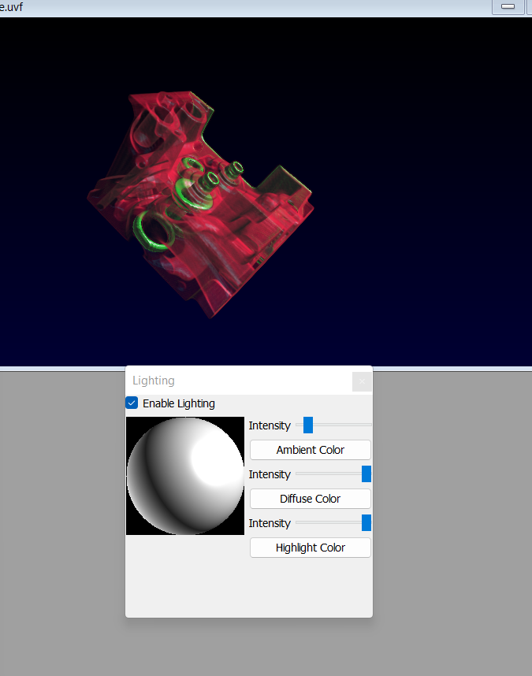

# Visualization Lab 3
## Prateek Sengar

### Datasets
1. Hand: CT scan of a human hand
2. Head: Visible human CT head

### Hand
**Iso-Surface Images**
1. Only Skeleton colored in red (no veins)
   
   
   
3. Only Outer surface of hand (no veins)

   

**Multiple Surface Image**
Only Skeleton and outer surface visible

### Head
**Iso-Surface Images**
1. Only Skeleton colored in cyan

   
   
3. Skin and lungs with green

   

**Multiple Surface Image**
Only Skeleton and lungs

### Optional Experiment
**2D Transfer Function**

**Lighting**

